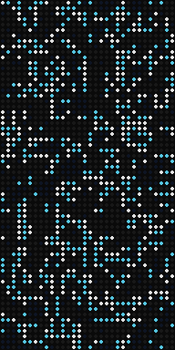
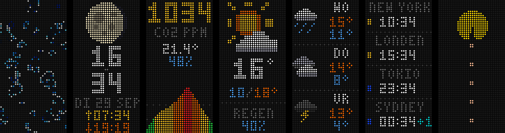
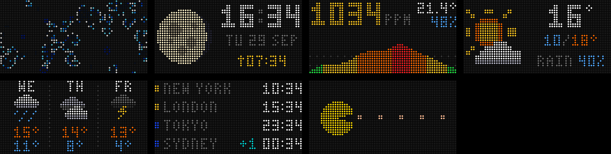

# Matrix Portal: Game of Life ⇄ dashboard

A CircuitPython project for the **Adafruit Matrix Portal M4** and a **64×32 RGB LED matrix**. It has two modes, and you switch between them with the buttons on the board:

- **Conway's Game of Life.** Cells are colored by age, and dying cells leave a short trail. A world runs until it has really finished, then a new one starts with the next color theme.
- **A rotating dashboard.** Screens: clock with moon phase, indoor CO₂, today's weather, a 3-day forecast and world clocks, with animated GIFs between them.

The panel works **upright (32×64) and sideways (64×32)**. The built-in accelerometer detects how it hangs, and the image turns with the panel without a restart.

<p align="center"></p>

**Upright:** Game of Life · clock + moon · CO₂ · weather · forecast · world clocks · GIF



**Sideways:**



## Features

- **Game of Life** on a wrap-around (toroidal) world, with 4 color themes and 6 speeds.
- **"Finished" detection.** The code keeps a CRC32 fingerprint of the last 1024 generations. A world ends only when the whole grid keeps repeating: still lifes, oscillators, or gliders that loop around the screen forever.
- **Clock** with NTP time and moon phase. It also shows sunrise and sunset.
- **Daylight saving time is calculated on the board** (EU / US / AU rules), so the clock stays correct without internet.
- **Weather** from [Open-Meteo](https://open-meteo.com/). It's free and needs no API key. There are pixel-art icons for sun, clouds, rain, snow, thunder, fog and clear nights.
- **Indoor air** from an optional **SCD-30** CO₂ sensor: ppm (green/yellow/orange/red), temperature, humidity and a 2-hour graph. A blinking red dot appears during Game of Life when CO₂ is above 1200 ppm.
- **World clocks** for up to 4 cities. Each has a day/night dot and a +1/−1 day marker.
- **Animated GIFs**, converted on your computer with a script (see [GIFs](#gifs)).
- **Auto-rotation** in all 4 directions, using the on-board LIS3DH accelerometer.

## Hardware

| Part | Notes |
|---|---|
| [Adafruit Matrix Portal M4](https://www.adafruit.com/product/4745) | Has an on-board ESP32 for WiFi, an accelerometer and UP/DOWN buttons |
| 64×32 RGB LED matrix (HUB75) | Tested with 4 mm pitch |
| 5 V USB-C power supply, ≥ 2 A | A computer USB port may be too weak for bright images |
| *Optional:* [SCD-30 CO₂ sensor](https://www.adafruit.com/product/4867) | Plugs into the STEMMA QT connector |
| *Optional:* push button | Wire it between **A1** and **GND**. No resistor needed. |

## Installation

1. **Install CircuitPython 10.x.** Download it from [circuitpython.org/board/matrixportal_m4](https://circuitpython.org/board/matrixportal_m4/). Double-tap reset, then drag the `.uf2` file onto the **MATRIXBOOT** drive.
2. **Copy the libraries.** Get them from the [CircuitPython library bundle](https://circuitpython.org/libraries) for the same major version, and put them in `CIRCUITPY/lib/`:
   - `adafruit_esp32spi/` (folder)
   - `adafruit_bus_device/` (folder)
   - `adafruit_register/` (folder)
   - `adafruit_connection_manager.mpy`
   - `adafruit_requests.mpy`
   - `adafruit_ticks.mpy`
   - `adafruit_scd30.mpy` (CO₂ sensor)
   - `adafruit_lis3dh.mpy` (accelerometer)
3. **Copy the contents of [`CIRCUITPY/`](CIRCUITPY/)** from this repo to the drive. That's all the `.py` files, `gifs_landscape/` and `gifs_portrait/`.
4. **Create your settings.** Copy `settings.toml.example` to `settings.toml` on the drive and fill in your WiFi and location:
   ```toml
   CIRCUITPY_WIFI_SSID = "your-wifi-name"
   CIRCUITPY_WIFI_PASSWORD = "your-wifi-password"
   LATITUDE = "52.37"
   LONGITUDE = "4.89"
   NIGHT_START = "22:00"   # optional night mode, "" = off
   NIGHT_END = "08:00"
   ```
   To find your coordinates, right-click your home in Google Maps. The first number is the latitude, the second the longitude.

The board restarts every time you save a file. To see what it's doing, open the serial console at 115200 baud, for example with `screen /dev/cu.usbmodem* 115200` or in the [Mu editor](https://codewith.mu/).

### WiFi must be 2.4 GHz WPA2

The ESP32 on the Matrix Portal M4 **can't connect to WPA3** networks, or to 5 GHz-only networks. If the console shows `No such ssid` or `Failed to connect`:

- Make a 2.4 GHz **WPA2** network (many mesh systems have an "IoT" or guest option for this), or switch your network to WPA2.
- Set the 2.4 GHz channel to **1, 6 or 11**. Channel 13 can cause trouble.
- If it still fails, update the ESP32 firmware (see below).

<details>
<summary><b>Updating the ESP32 (NINA) firmware</b></summary>

Boards from before 2021 often ship with NINA firmware 1.2.x. To update it:

1. Double-tap reset and drag the [MatrixPortal ESP32 passthrough UF2](https://learn.adafruit.com/upgrading-esp32-firmware/upgrade-all-in-one-esp32-airlift-firmware) onto **MATRIXBOOT**.
2. Flash the latest `NINA_ADAFRUIT-esp32-x.y.z.bin` from [adafruit/nina-fw releases](https://github.com/adafruit/nina-fw/releases):
   ```bash
   pip install esptool
   esptool.py --port /dev/cu.usbmodem101 --baud 115200 --before no_reset write_flash 0 NINA_ADAFRUIT-esp32-3.3.0.bin
   ```
3. Double-tap reset again and put CircuitPython back on. Your files on the CIRCUITPY drive are kept.

</details>

## Buttons

| | Game of Life | Dashboard |
|---|---|---|
| **UP**, short press | faster (a bar at the bottom shows the speed) | next screen |
| **DOWN**, short press | slower | previous screen |
| **UP or DOWN**, hold 0.8 s | switch to dashboard | switch to Game of Life |
| **UP + DOWN** together | new world | next screen |
| **UP + DOWN** hold 2 s | standby (screen off) | standby (screen off) |
| any button in standby | wake up (the press does nothing else) | same |
| External button on A1 | short: switch mode · long: new world / next screen | same |

## Standby and night mode

Hold **UP + DOWN for 2 seconds** to switch the screen off. Any button wakes it up again, and you continue where you left off. WiFi, time and the CO₂ graph are kept, and the sensor keeps measuring in standby.

**Night mode** puts the screen in standby automatically, for example from 22:00 to 08:00. Set the times in `settings.toml`:

```toml
NIGHT_START = "22:00"
NIGHT_END = "08:00"
```

Leave both empty (`""`) to turn it off. If you wake the screen up during the night, it goes back to standby after 10 minutes without a button press (`NIGHT_WAKE_MINUTES` in `code.py`). The panel uses by far the most power. In standby only the board and the WiFi chip stay on, together about 0.1 A.

## GIFs

The M4 can't decode GIFs itself. Instead, you convert them on your computer into a *sprite sheet*: one 8-bit BMP with all frames stacked on top of each other. The frame time is part of the file name, for example `cat_d80.bmp` = 80 ms per frame.

There are two folders on the drive:

| Folder | Size | Used when the panel is |
|---|---|---|
| `gifs_landscape/` | 64×32 | sideways |
| `gifs_portrait/` | 32×64 | upright |

Because the panel rotates automatically, put each GIF in **both** folders. Otherwise it only shows up in one orientation.

### Adding a GIF

You need Python 3 and Pillow (`pip install pillow`):

```bash
# sideways
python3 tools/gif2bmp.py cat.gif -o /Volumes/CIRCUITPY/gifs_landscape
# upright
python3 tools/gif2bmp.py --portrait cat.gif -o /Volumes/CIRCUITPY/gifs_portrait
```

Useful options (try a few, the best choice depends on the GIF):

| Option | What it does |
|---|---|
| `--fit cover` | fill the whole screen and crop, instead of black bars |
| `--bg edge` | fill the bars with the GIF's own background color |
| `--black-bg` | make a (white) background black. White is harsh on LEDs. |
| `--trim` | cut away empty space around the subject so it gets bigger |
| `--sharp` | sharp nearest-neighbor scaling, for pixel art |
| `--split` | wide image on an upright panel: put the left half above the right half |
| `--name NAME` | output file name |

GIFs with more than 90 frames are thinned out automatically (every 2nd or 3rd frame), so the whole animation still fits. Aim for a few hundred KB per folder in total, because the drive has about 1.4 MB free.

### Removing a GIF

Delete the `.bmp` from `gifs_landscape/` and `gifs_portrait/` on the CIRCUITPY drive. The board restarts and the GIF is gone from the rotation.

### Demo GIFs

This repo includes two self-made demos, a chase and a plasma, in both orientations. You can recreate them with `python3 tools/make_demo_gifs.py`.

## Settings

Everything is at the top of [`CIRCUITPY/code.py`](CIRCUITPY/code.py):

| Setting | Default | Meaning |
|---|---|---|
| `AUTO_ROTATE` | `True` | follow the accelerometer |
| `PORTRAIT`, `FLIP` | `True`, `True` | fixed orientation when auto-rotate is off or the panel lies flat |
| `BRIGHTNESS` | `0.7` | 0.1–1.0 |
| `START_MODE` | `"life"` | `"life"` or `"dashboard"` |
| `LIFE_SPEEDS_MS`, `LIFE_SPEED` | `(0, 300, …, 2000)`, `1` | speeds in ms per generation. The board needs ~170 ms per generation itself. |
| `LIFE_MAX_GENS` | `None` | optional cap on generations per world |
| `ORDER` | clock, gif, air, gif, … | dashboard order. Each `"gif"` plays the next GIF. |
| `DURATIONS` | 10–20 s | seconds per screen. A GIF always plays at least once, at most 2× this long. |
| `HOME_TZ` | `(1, "EU")` | your timezone: standard UTC offset + DST rule |
| `WORLD_CLOCKS` | New York, London, Tokyo, Sydney | up to 4 × `(name, UTC offset, "EU"/"US"/"AU"/None)` |
| `AIR_GRAPH_MINUTES` | `120` | time span of the CO₂ graph |
| `CO2_ALERT_PPM` | `1200` | red-dot threshold during Game of Life |
| `STANDBY_HOLD_MS` | `2000` | how long to hold UP + DOWN for standby |
| `NIGHT_WAKE_MINUTES` | `10` | woken up at night: back to standby after this long |

The night times themselves (`NIGHT_START`, `NIGHT_END`) are in `settings.toml`, together with your WiFi and location.

## How it works

| File | What it does |
|---|---|
| `code.py` | settings, buttons, main loop, live rotation |
| `life.py` | Game of Life: fast row-sum algorithm, age colors, "finished" detection |
| `dashboard.py` | all dashboard screens (upright + sideways layouts) and the GIF player |
| `gfx.py` | 3×5 pixel font, weather icons, moon renderer |
| `net.py` | WiFi via the ESP32, NTP time, Open-Meteo weather |
| `tz.py` | timezones with DST rules, no internet needed |
| `air.py` | SCD-30 CO₂ sensor |
| `orientation.py` | LIS3DH accelerometer → screen rotation |
| `tools/gif2bmp.py` | GIF → sprite-sheet converter (runs on your computer) |

**When is a Game of Life world "finished"?** On a finite, wrap-around world, every pattern eventually settles into a cycle: still lifes, blinking oscillators, or gliders that come back to the same spot. From then on nothing new ever happens. The code stores a CRC32 fingerprint of each generation. When the world has only shown states it has seen before for 40 generations in a row, it has truly started repeating. The code then shows the end state briefly and starts a new world. (Python's `hash()` can't be used for this: on CircuitPython it returns the same value for every byte string.)

## Credits

- Weather data by [Open-Meteo.com](https://open-meteo.com/) (CC BY 4.0)
- Built on [CircuitPython](https://circuitpython.org/) and the Adafruit CircuitPython libraries

## License

[MIT](LICENSE)
